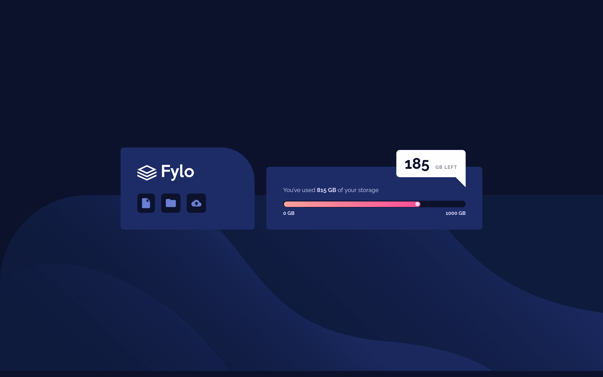

# Frontend Mentor - Fylo data storage component solution

This is a solution to the [Fylo data storage component challenge on Frontend Mentor](https://www.frontendmentor.io/challenges/fylo-data-storage-component-1dZPRbV5n). Frontend Mentor challenges help you improve your coding skills by building realistic projects. 

## Table of contents

- [Overview](#overview)
  - [The challenge](#the-challenge)
  - [Screenshot](#screenshot)
  - [Links](#links)
- [My process](#my-process)
  - [Built with](#built-with)
  - [What I learned](#what-i-learned)
  - [Continued development](#continued-development)
- [Author](#author)

## Overview

### The challenge

Users should be able to:

- View the optimal layout for the site depending on their device's screen size

### Screenshot

### Links

- Live Site URL: [Fylo Data Storage Component](https://slightlyfunctional.gitlab.io/fylo-data-storage-component/)

## My process

### Built with

- Semantic HTML5 markup
- CSS custom properties
- Flexbox
- Mobile-first workflow
- [Sass](https://sass-lang.com/) - CSS Preprocessor
- [Parcel](https://parceljs.org/) - Bundler

### What I learned

I learned more about CSS animations.

### Continued development

I focused on trying to adhere to design while adding small animations in CSS. I used CSS for animating a mock loading skeleton for the storage usage bar while using js to animate the actual bar. In the future I will aim to use only CSS.

## Author

- Website - [slightlyfunctional.com](https://slightlyfunctional.com)
- Frontend Mentor - [@slightlyfunctional](https://www.frontendmentor.io/profile/slightlyfunctional)
